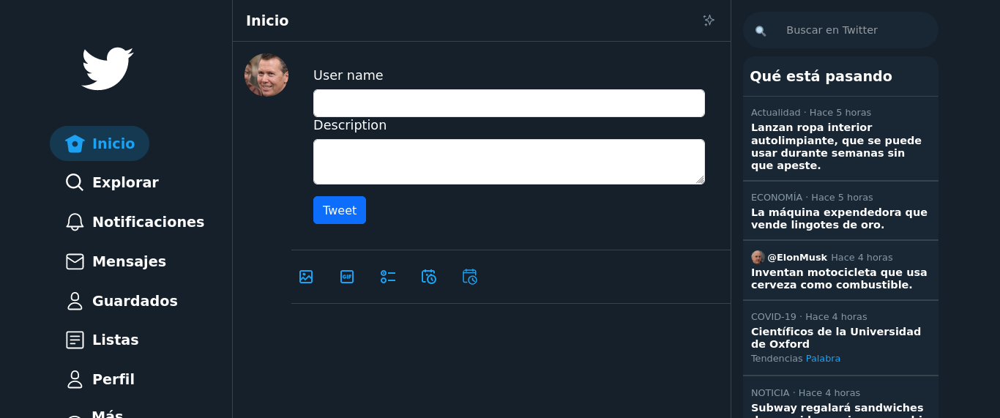

<!--  -->


# Clon de Twitter

_Proyecto para mostrar registros de una base de datos postgresql simulando la plataforma Twitter._

## Comenzando 🚀

Para descargar (clonar) este repositorio debes ejecutar en tu cónsola:

```hash
git clone https://github.com/apinango70/clon_twitter
```

### Pre-requisitos 📋

Para ejecutar este proyecto, debes tener instalado ruby

```hash
https://rubyinstaller.org/
```

Instalar la gema Bundler

```hash
gem install bundler
```

Instalar la gema rails

```hash
gem install rails
```

Instalar postgresql

```hash
https://www.postgresql.org/
```

### Instalación 🔧

Para mostrar localmente este proyecto, debes garantizar que todas las dependencias de gemas estén configuradas correctamente, para eso debes ejecutar:

Agregar la gema pagy al gemfile (pagy ya está configurada para ejecutarse en este proyecto.)

```hash
bundle add pagy
```

Agregar la gema faker (solo si se van a crear datos ficticios en la base de datos)

```hash
bundle add pagy
```

Se debe crear la base de datos y correr la migración ejecutando:

```hash
rails db:create
rails db:migrate
```

Si qieres crear datos de prueba, debes ejecutar el seed.rb con el siguiente comando (debes haber instalado la gema aker previamente):

```hash
rails db:seed
```

Una vez que se han actualizado todas las gemas, creado la base de datos y generado los datos de prueba, se debe montar el servidor ejecutando:

```hash
rails s
```

En el navegador debes ir a la página:

```hash
localhost:3000/
```

## Despliegue 📦

Para hacer un deploy en Herokuu, debes seguir los siguientes pasos en la cónsola:

* Logearse en heroku

```hash
heroku login
```

* Crear la app en heroku

```hash
heroku create
```

* Ejecutar git a  remote

```hash
git remote
```

* Ejecutar bundle para tener el proyecto actualizado hasta ese momento

```hash
bndle install
```

* Hacer un commit antes de subir la app a heroku

```hash
git add .
```

```hash
git commit -m "Mensaje del commit"
```

* Enviar el proyecto a la rama main en heroku

```hash
git push heroku main
```

## Construido con 🛠️

Para el desarrollo de este proyecto se utilizaron las sigientes heramientas

* [Ruby 3.2.2](https://www.ruby-lang.org/es/)
* [Rails 7.0.6](https://rubyonrails.org/)
* [Bootstrap 5.3](https://getbootstrap.com/docs/5.3/getting-started/download/)
* [Postgresql 14.8](https://www.postgresql.org/)
Imagenes utilizadas:
* [Imágenes de los usuarios - thispersondoesntexist](https://thispersondoesnotexist.com/)
* [Imágenes para los tweets - lorem picsum](https://picsum.photos/)
* [Modelo html tomado del proyecto de Eduardo Fierro](https://github.com/eduardofierropro/TwitterRap/)

## Contribuyendo 🖇️

Por favor siéntete libre de enviar pull requests y hacer forks.

## Autores ✒️

* **Alejandro Piñango** - Trabajo Inicial y Documentación - [apinango](https://github.com/apinango70)

## Licencia 📄

Este proyecto está bajo la Licencia (MIT) - mira el archivo [LICENSE.md](LICENSE.md) para detalles

---

Hecho con ❤️ por [apinango70](https://github.com/apinango70) 😊
